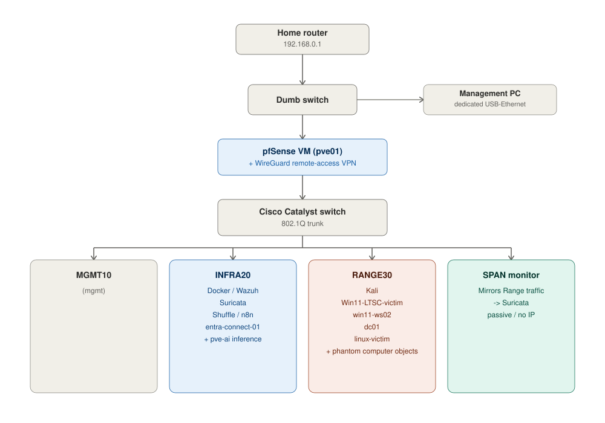

# Home SOC Lab

A home-built Security Operations Center lab — network segmentation, detection
engineering, adversary emulation across a full kill chain, hybrid identity
(on-prem Active Directory + Microsoft Entra ID), SOAR automation, and
AI-assisted triage, built from scratch on retired enterprise hardware. Built
as a hands-on portfolio piece and working lab, in support of a transition
from an IT/network administration role into a SOC Analyst / IAM Analyst
role.

**Author:** U.S. Air Force veteran, IT/security professional (8+ years),
CompTIA A+ / Network+ / Security+ / CySA+ / PenTest+, BS in IT Networking
and Security.

> **Note:** This repo is intentionally framed to present a security-focused
> engineering trajectory — the goal is a working SOC stack that demonstrates
> real detection engineering, adversary emulation, hybrid identity attack and
> defense, automation, and governed AI-assisted triage, not just
> administration.

---

## Architecture

**Hybrid identity layer:** `dc01` (on-prem AD, domain `soclab.internal`)
syncs to a Microsoft Entra ID tenant via Entra Connect, extending the lab's
attack surface into the cloud identity layer alongside Exchange Online mail
and Conditional Access — one continuous on-prem-to-cloud compromise story,
not two disconnected efforts.

**Three layers of detection**, as in a real SOC:
- **Host-based** — Sysmon/`auditd` on victim VMs -> Wazuh agent -> Wazuh
  (crosses Range->Infra on TCP 1514/1515 only)
- **Network-based** — SPAN port mirrors Range VLAN traffic -> Suricata
  (passive) -> alerts into Wazuh
- **Identity-based** — Entra ID sign-in logs, Conditional Access
  enforcement outcomes, Exchange Online Protection mail-flow logs

[Link To Lab Diagrams](https://securityjonesing.github.io/SOC-LAB/Diagrams/SOC-Lab-Diagrams.html) — network topology, the full kill chain, the AD attack-surface map, hybrid identity architecture, agent governance, and more

## Hardware

| Node | Spec | Role |
|---|---|---|
| `pve01` | Dell PowerEdge R710, Xeon X5675, 64GB RAM | Primary Proxmox host — pfSense, Wazuh, Suricata, Shuffle, n8n, `entra-connect-01`, Range VMs, service UIs |
| `pve-ai` | i9-10900KF (no iGPU), RTX 3070 (8GB) | GPU inference only (Ollama) — lab/SOC use only, not personal AI use |
| Cisco Catalyst WS-C2960X-48FPS-L | IOS 15.2(7)E9 | VLAN trunk + management access port |

## VLAN design

| VLAN | Purpose | Access |
|---|---|---|
| **MGMT10** | Management PC | Full access to all VLANs for admin (Proxmox, Wazuh, Shuffle, n8n, pfSense, iDRAC, Entra ID admin center, Exchange admin center) |
| **INFRA20** | Docker/Wazuh host, `pve-ai`, `entra-connect-01`, Shuffle | Receives Range logs; scoped outbound internet; one narrow, reviewed Pass rule to `dc01` on RANGE30 for Entra Connect sync — the one INFRA20→RANGE30 exception in the build |
| **RANGE30** | Kali, Win11-LTSC-victim, `win11-ws02`, `dc01`, `linux-victim`, phantom AD computer objects | Default-deny; explicit allows to Infra's Wazuh ports only (1514 ingest, 1515 enrollment); one narrow inbound exception for Entra Connect sync |

## Stack

- **Firewall/Routing/VPN:** pfSense CE 2.8.1, WireGuard remote-access VPN
- **Detection:** Wazuh 4.14.6 (host-based, Docker Compose) + Suricata (network-based, via SPAN) + `auditd` (Linux)
- **Directory services:** Windows Server 2022 AD DS (`dc01`, domain `soclab.internal`), a tiered OU/group RBAC structure, and a full realistic Active Directory environment — hybrid-synced to Microsoft Entra ID via Entra Connect
- **Identity/Email:** Microsoft Entra ID (Free tier, permanent, plus a time-boxed P1 trial for Conditional Access/MFA), Exchange Online Plan 1 with Defender for Office 365 Attack Simulation Training for phishing exercises — no on-prem Exchange Server
- **Adversary emulation:** Atomic Red Team (single-technique validation) plus a manual, full end-to-end kill chain (Initial Access → Impact) run entirely by hand — no orchestration tooling — across a real two-host lateral-movement path, six deliberately planted AD misconfigurations (including an ADCS ESC1 template and a DCSync-rights gap), and cloud identity enumeration via AADInternals/ROADtools extending the chain into Entra ID
- **C2:** Sliver
- **SOAR:** Shuffle — SOC incident response automation
- **AI orchestration:** n8n — local-vs-cloud routing (`triage-router-01`), lab/SOC and general lab automation only
- **AI inference:** Ollama on `pve-ai` (RTX 3070), local-first; Claude Code
  (`claude -p`, subscription-covered) or Grok as cloud escalation on a
  threshold
- **Chat UI:** Open WebUI, points at Ollama with Claude/Grok selectable
- **Case management (planned, deferred):** TheHive + Cortex

## Agent governance

Every non-human actor in this lab gets its own credential, least-privilege
scope, and a separate audit trail — never runs under my personal login or
an admin account. Currently registered in [`agent-registry.md`](./agent-registry.md):
`wazuh-triage-01` (the alert-triage specialist), `triage-router-01` (the
local-vs-cloud routing layer it calls into), the Shuffle playbook identity,
and the Entra Connect sync account. None are built yet — see the registry
for planned scope and status.

## Phase status

| Phase | Status | Notes |
|---|---|---|
| 1 — Network Rebuild | ✅ Complete | VLANs, trunk, mgmt access port, pfSense VM + interfaces. Snapshot `pfsense-clean-install`. |
| 2 — Isolation Rule | ✅ Complete | Range default-deny + explicit Wazuh-port allow, applied and reviewed. |
| 3 — Wazuh Substrate | ✅ Complete | Ubuntu Server 24.04.4 LTS VM (`wazuh-host`) built; Docker CE + Compose installed; Git configured with a dedicated SSH deploy key. Wazuh 4.14.6 deployed via Docker Compose (manager + indexer + dashboard, single-node), default credentials changed. INFRA20 has 5 outbound rules; RANGE30 has 3 rules. Win11-LTSC-Victim moved to Range VLAN, isolation proven live, instrumented with Sysmon and the Wazuh agent — first real endpoint enrolled and reporting active. |
| 4 — Detection Engineering | ✅ Complete | Atomic Red Team fully staged and working on Win11-LTSC-Victim. Six custom detection rules written, debugged, and confirmed firing against real atomic test traffic, spanning five tactics: `100002`/`100003` (PowerShell spawned by a suspicious parent process, escalating on encoded commands, T1059.001/T1027 — Execution), `100004` (registry Run/RunOnce key persistence, T1547.001 — Persistence), `100005` (LSASS credential dumping via Silent Process Exit / IFEO GlobalFlag abuse, T1003.001 + T1546.012 — Credential Access), `100006` (local account/group enumeration via net.exe, T1087.001 — Discovery), `100007` (network share removal via net.exe, T1070.005 — Defense Evasion). All six rules chained via `if_sid` — no remaining `if_group` root-level short-circuit risk in the rule set. Claude Code has dedicated key-based SSH access to `wazuh-host`. SSH key-only hardening on `wazuh-host` complete (2026-08-11) — password auth disabled, key-based login verified. `100006` was later tuned (2026-09-07) to exclude `net.exe` spawned by `wazuh-agent.exe` itself, since Wazuh's own inventory collector was tripping the rule. Known gap: Sysmon's current config does not capture FileDelete-family events (Event 23/26) — attempted enabling Event 26 on 2026-08-18, config validated and reloaded clean but the event never fired; root cause not isolated, next hypothesis is Defender/PPL interaction. Still open: rotate the `wazuh-host` account password (briefly exposed in plaintext by an automation tool, caught before use) — key-only SSH login is enforced, but the underlying account password itself has not yet been rotated. |
| 5 — Network Visibility | ⏳ Functionally complete, persistence outstanding | Full detection path proven end to end: VM tap → `tc` mirror → `wazuh-host` second NIC (`ens19`) → Suricata → `eve.json` → bind mount → Wazuh manager → indexer → dashboard, confirmed live by a Suricata alert (rule.id `86601`, `ET INFO Possible Kali Linux hostname in DHCP Request Packet`) appearing in Threat Hunting under `wazuh.manager`. Suricata 8.0.6 on `wazuh-host` (OISF PPA), Emerging Threats Open ruleset (52,713 rules enabled), `/var/log/suricata` bind-mounted read-only into the manager container. The `Too many fields for JSON decoder` blocker was resolved by disabling `stats` inside the eve-log `types:` list; it had in fact been resolved since the prior session, masked by a verification method that sampled an append-only log by line count rather than by timestamp. **Architectural finding:** the physical switch SPAN (source VLAN 30 → `Gi1/0/4` → `eno4` → `vmbr4`) proved blind to all east-west traffic. Kali, Win11-LTSC-Victim and pfSense all run on `pve01` attached to `vmbr3`, and a Linux bridge switches VM-to-VM frames in software without ever egressing to the Cisco switch — so the SPAN carried only broadcast/multicast noise (ARP visible, TCP absent; Wazuh agent traffic on 1514 absent entirely). Remediated at the hypervisor layer with `tc mirred` ingress mirrors on `tap100i0` and `tap101i0` targeting `tap103i1`, verified bidirectionally via a captured SYN/SYN-ACK exchange on 3389. The switch SPAN path remains valid for north-south traffic. **Remaining:** the `tc` mirrors are runtime-only and do not survive a `pve01` reboot or a VM restart (which recreates the tap and silently drops that VM's mirror). Proxmox hookscripts are the preferred persistence mechanism, since they re-apply on both VM start and host boot. |
| 6 — Attack Surface | ⏳ In progress | Kali moved from flat `vmbr1` to RANGE30 and confirmed isolated (2026-08-18 — no internet, no home/MGMT reach, no ICMP to INFRA20, consistent with the Range default-deny model already proven for Win11-LTSC-Victim). Remaining: pfSense log forwarding into Wazuh, WireGuard remote-access VPN. |
| 7 — AD Expansion | ⏳ Not started | AD/DC build (`dc01`, `win11-ws02`, tiered OUs/groups/GPOs, six deliberate misconfigurations, file shares, ADCS) and the full manual kill chain (reduced scope — no full interactive `dc01` compromise). |
| 8 — Hybrid Identity | ⏳ Not started | Entra ID Free + P1 trial, Entra Connect hybrid sync, Exchange Online, Conditional Access/MFA, cloud identity enumeration |
| 9 — AI Triage Layer | ⏳ Not started | Governed Wazuh triage agent (`wazuh-triage-01`) |
| 10 — Local AI and Routing | ⏳ Partially complete | `pve-ai`/`ai-vm` GPU-passthrough infrastructure built and verified (2026-07-13); Ollama/Open WebUI stack and n8n routing still to come |
| 11 — SOAR | ⏳ Not started | Slots in after the detection/attack-surface phases |
| 12 — Case Management | ⏸ Deferred | Requires Cassandra + Elasticsearch, attempted after phases 10 and 11 are stable |

**Numbering note:** phases were renumbered from the original A/A.5/B/C/C.5/C.6/C.7/D/E/F/G scheme to permanent integers 1–12 on 2026-09-06. See `LAB-BLUEPRINT.md` for the full old-to-new mapping.

**Explicitly out of scope, evaluated and deliberately excluded** (see `LAB-BLUEPRINT.md` for full reasoning): MITRE Caldera, Entra ID P2, on-prem Exchange Server, standalone GoPhish + mail relay, and full interactive host-level compromise of `dc01`.

## Documentation

- [`LAB-BLUEPRINT.md`](./LAB-BLUEPRINT.md) — what's being built and in what order, including the locked-scope build plan and explicitly out-of-scope items
- [`build_log.md`](./build_log.md) — the running record, organized by phase, of every change and its actual output — now also incorporating the merged AI node build history
- [`agent-registry.md`](./agent-registry.md) — scope/owner/lifecycle for every AI agent and privileged non-human identity in the lab
- [`PROJECT-INSTRUCTIONS.md`](./PROJECT-INSTRUCTIONS.md) — environment reference used to drive Claude sessions
- <a href="https://securityjonesing.github.io/SOC-LAB/Diagrams/SOC-Lab-Diagrams.html" target="_blank" rel="noopener">`Diagrams/SOC-Lab-Diagrams.html`</a> — the eight reference diagrams, opens in a new tab
- <a href="https://securityjonesing.github.io/SOC-LAB/Diagrams/architecture-diagram.svg" target="_blank" rel="noopener">`Diagrams/architecture-diagram.svg`</a> — the network architecture diagram shown above, opens in a new tab
